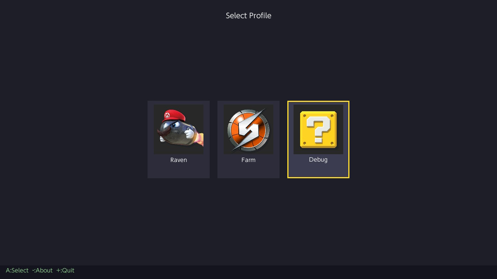
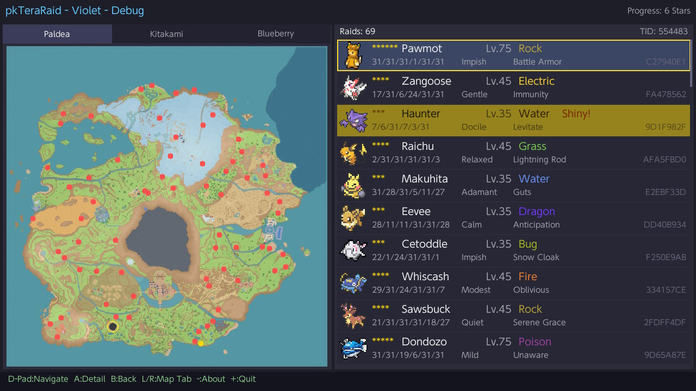
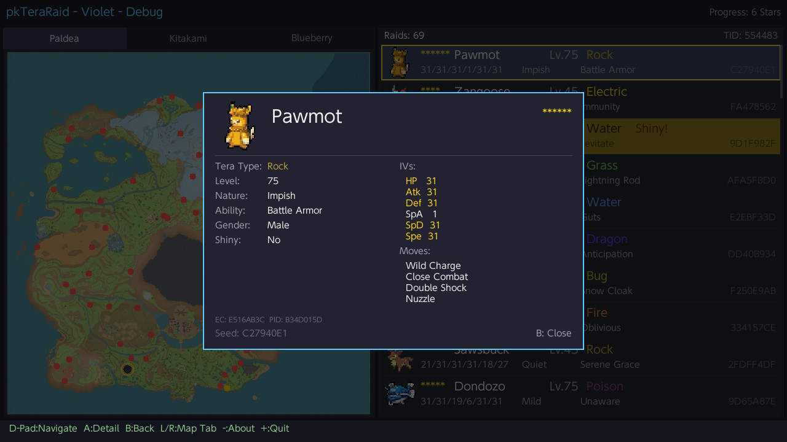
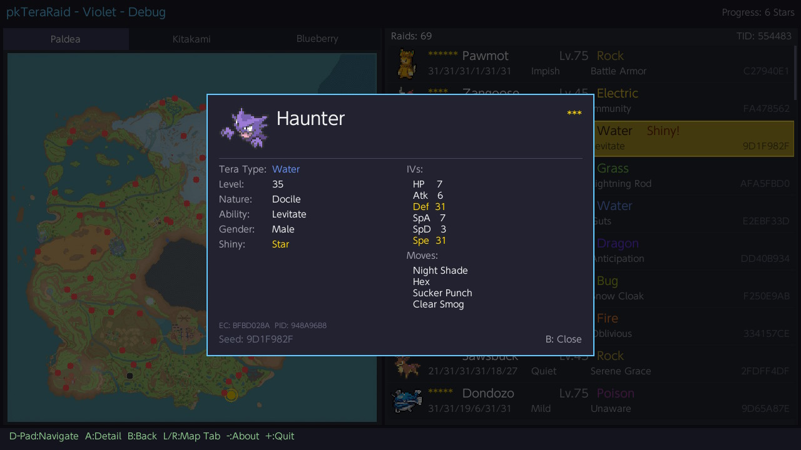
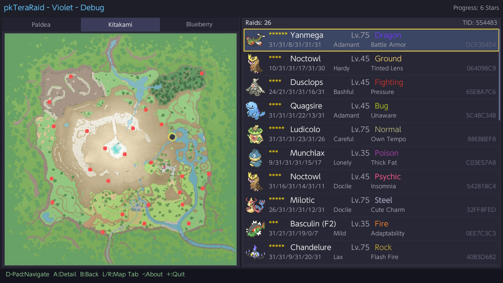
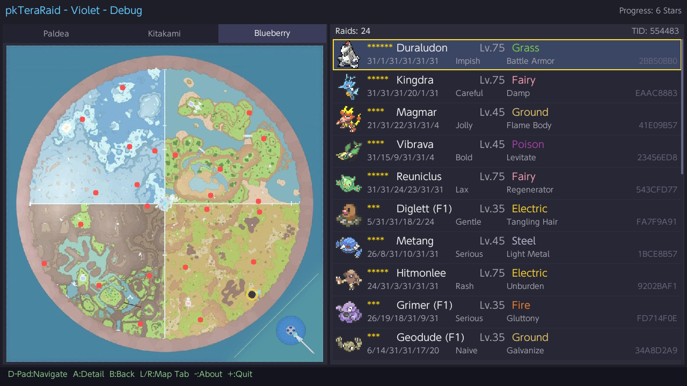
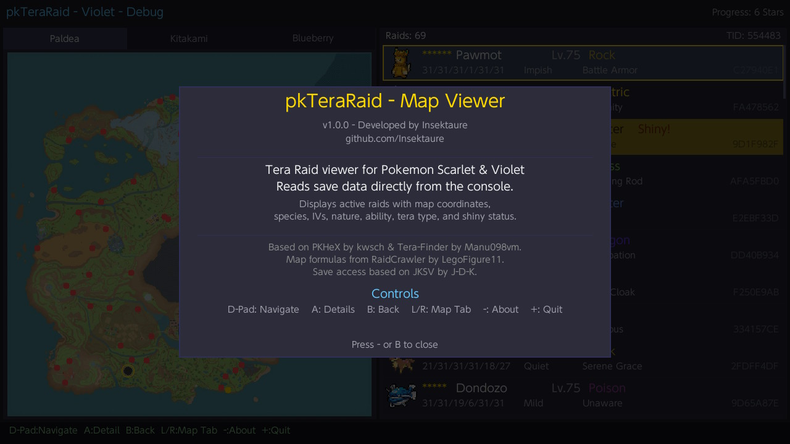

# pkTeraRaid - Map Viewer

A Nintendo Switch homebrew application for viewing raid details in Pokemon Scarlet & Violet and Sword & Shield.

## Features

### Pokemon Scarlet & Violet — Tera Raids

- **Dual mode support**
  - **Save file mode** (Title Override): Reads raid data from the game's save file. Supports profile selection.
  - **Live mode** (Applet / HBMenu overlay): Reads raid data directly from the running game's memory. Auto-detects Scarlet or Violet.
- **Interactive map view** with raid locations for all three regions:
  - Paldea
  - Kitakami (The Teal Mask DLC)
  - Blueberry Academy (The Indigo Disk DLC)
- **Detailed raid information** including:
  - Species with sprite preview
  - Star rating (1-6 stars, including 6-star black raids)
  - Tera type (with color-coded display)
  - IVs, Nature, Ability
  - Moves
  - Shiny status
  - Gender
  - PID and EC
  - **Reward preview** — calculated item drops from the raid seed, split by Host / Joiner / Everyone. Rare drops (Herba Mystica, Ability Patch, Ability Capsule, Bottle Cap, Gold Bottle Cap) are highlighted in gold
- **Raid list** with scrollable list panel alongside the map, showing shiny count per region
- **Raid filters** — composable filters to quickly find interesting raids:
  - **X button**: Cycle preset filter (All → 5+ Stars → 6 Stars → Rare Rewards)
  - **Y button**: Toggle shiny-only filter
  - Filters combine freely (e.g., Shiny + Rare Rewards) and active filters are highlighted in the header
- **Profile selector** with support for multiple Switch user profiles
- **Game selector** for switching between Sword, Shield, Scarlet, and Violet save data

### Pokemon Sword & Shield — Den Crawler

- **Dual mode support**
  - **Save file mode** (Title Override): Reads den data from the game's save file. Supports profile selection.
  - **Live mode** (Applet / HBMenu overlay): Reads den data directly from the running game's memory. Auto-detects Sword or Shield.
- **Interactive map view** with den locations across all three areas:
  - Wild Area
  - Isle of Armor
  - Crown Tundra
- **Den information** including:
  - Species with sprite preview
  - Star rating (1-5 stars)
  - Level (derived from star rating)
  - Pokemon types (with color-coded display)
  - Beam type (Normal / Rare / Event)
  - Flawless IVs
  - Shiny prediction (up to 10,000 advances)
  - Location name
  - Full 64-bit seed
- **Active/All dens toggle** — press X to switch between showing only active dens or all dens (including inactive ones) with their predicted encounters and shiny info
- **Den list** with scrollable list panel alongside the map
- **Profile selector** with support for multiple Switch user profiles
- **Game selector** for switching between Sword, Shield, Scarlet, and Violet save data

## Compatibility

- Scarlet / Violet version **3.0.1 / 4.0.0 only** !
- Sword / Shield version **1.3.2 only** !

## Requirements

- Nintendo Switch with [Atmosphere](https://github.com/Atmosphere-NX/Atmosphere) custom firmware
- Pokemon Scarlet, Violet, Sword, or Shield (physical or digital)
- **Save file mode**: Launch via title override (hold R while launching a game)
- **Live mode**: Launch from HBMenu overlay (album applet) while the game is running

## Controls

| Button | Action |
|--------|--------|
| D-Pad / Left Stick | Navigate |
| A | Select / View details |
| X | Cycle filter preset (SV) / Toggle active/all dens (SwSh) |
| Y | Toggle shiny filter (SV) |
| B | Back / Close details |
| L / R | Switch map tab |
| - | About |
| + | Quit |

## Building

### Prerequisites

- [devkitPro](https://devkitpro.org/wiki/Getting_Started) with libnx
- Switch portlibs: `SDL2`, `SDL2_ttf`, `SDL2_image`, `freetype`, `harfbuzz`, `libpng`, `libjpeg`, `libwebp`

Install portlibs:
```bash
sudo dkp-pacman -S switch-sdl2 switch-sdl2_ttf switch-sdl2_image switch-freetype switch-harfbuzz
```

### Build

```bash
export DEVKITPRO=/opt/devkitpro
make all
```

This produces `pkTeraRaid.nro`.

### Clean

```bash
make clean
```

## Installation

1. Copy `pkTeraRaid.nro` to `/switch/pkTeraRaid/` on your SD card.
2. Launch from HBMenu:
   - **Save file mode**: Hold R while launching any game to open HBMenu via title override, then select pkTeraRaid.
   - **Live mode**: With Pokemon SV running, open the album to access HBMenu overlay, then select pkTeraRaid.

## Screenshots

<div align="center">
  
  
  
  
  
  
  
  
</div>  

## Credits

- [PKHeX](https://github.com/kwsch/PKHeX) by kwsch - Save file structure and Pokemon data
- [Tera-Finder](https://github.com/Manu098vm/Tera-Finder) by Manu098vm - Raid encounter logic and data resources
- [RaidCrawler](https://github.com/LegoFigure11/RaidCrawler) by LegoFigure11 - Map coordinate formulas and reward table data
- [CaptureSight](https://github.com/zaksabeast/CaptureSight) by zaksabeast - SwSh den data structures and encounter tables
- [PKHeX Raid Plugin](https://github.com/architPokemon/PKHeX_Raid_Plugin) - SwSh den map coordinates and location data
- [JKSV](https://github.com/J-D-K/JKSV) by J-D-K - Save data access approach
- [Atmosphere](https://github.com/Atmosphere-NX/Atmosphere) - dmntcht for live memory reading

## License

This project is for personal/educational use. It relies on several open-source projects, each with their own licenses. Please refer to the individual projects linked above for their respective license terms.
