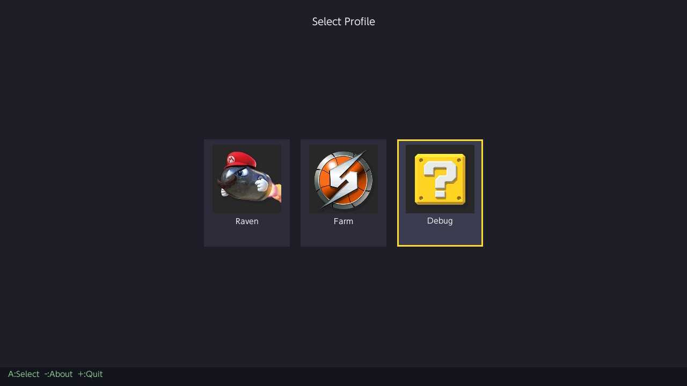
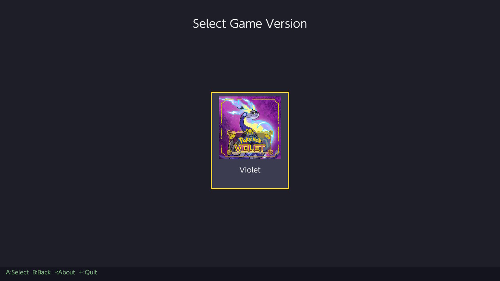
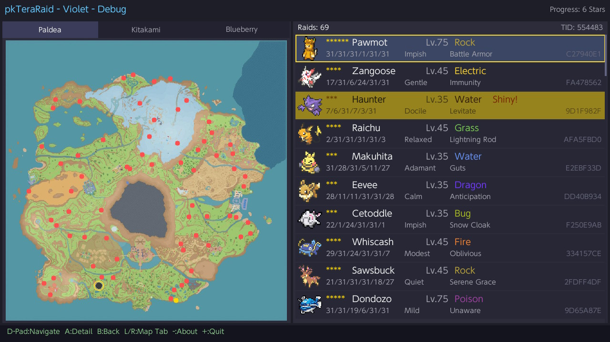
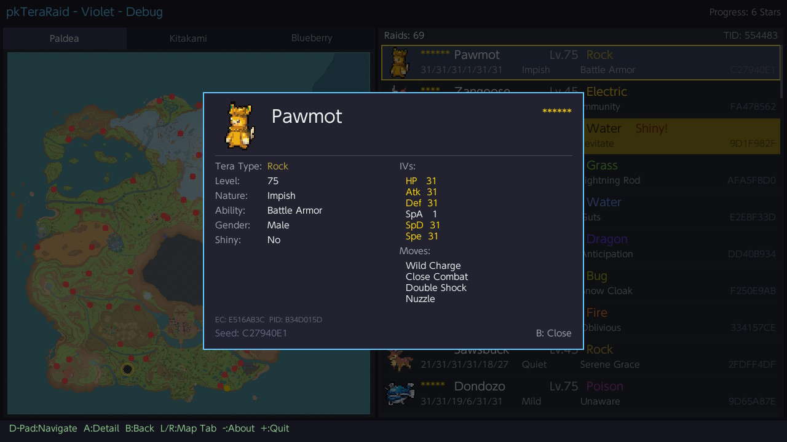
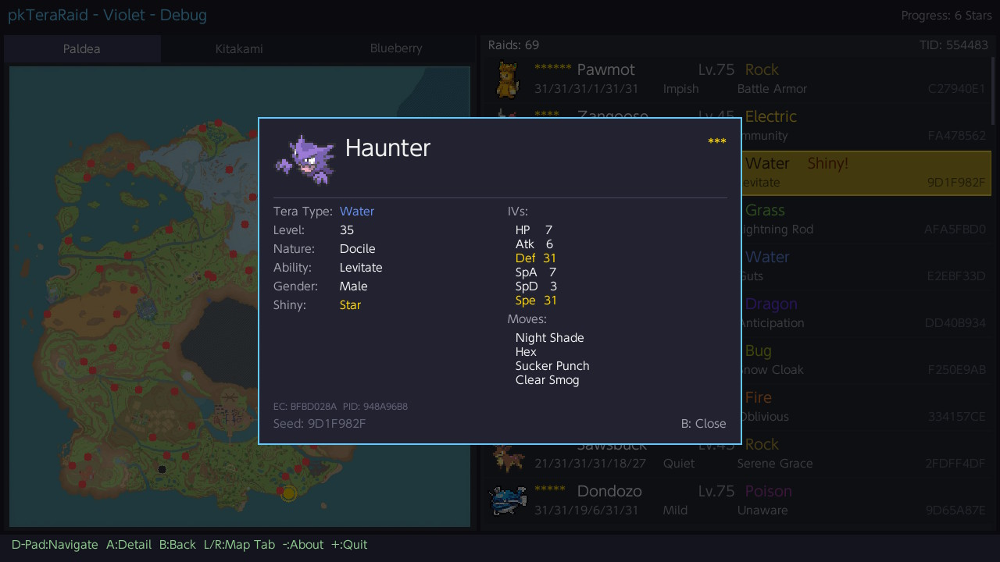
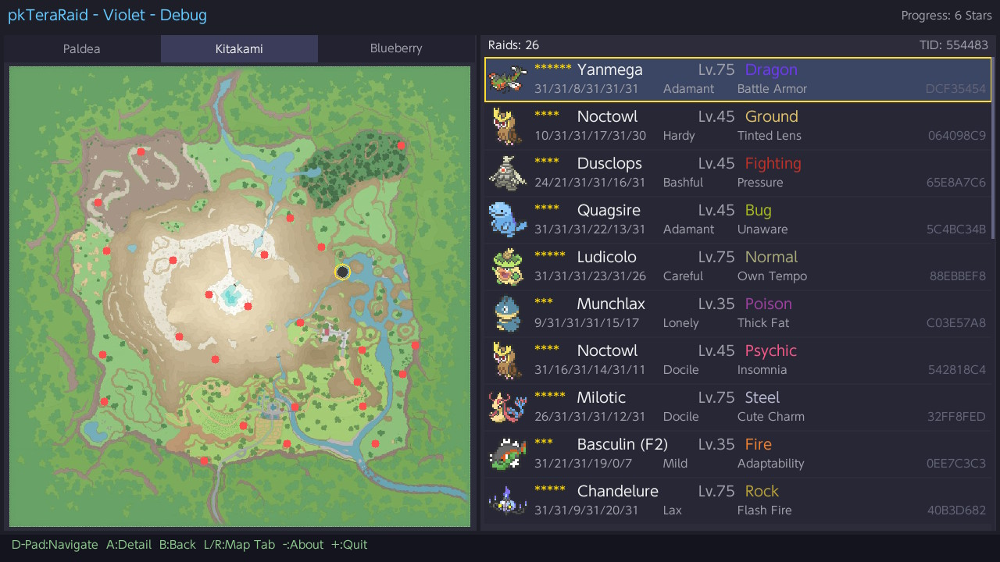
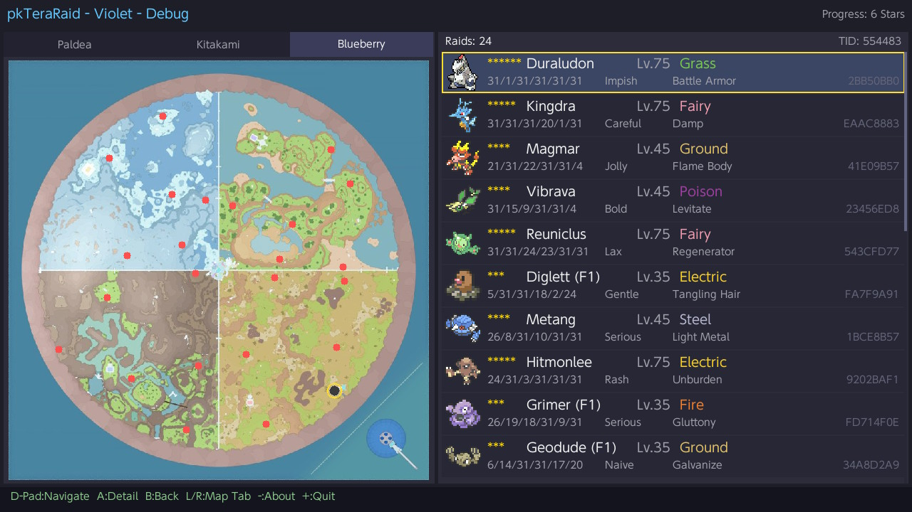
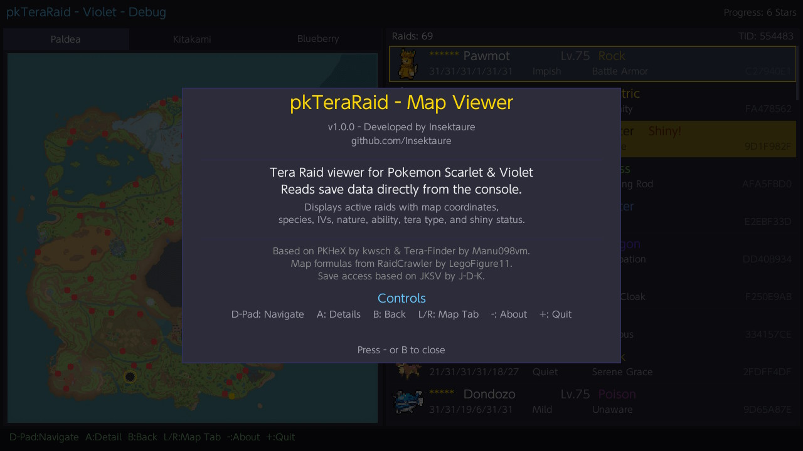

# pkTeraRaid - Map Viewer

A Nintendo Switch homebrew application for viewing raid details in Pokemon Scarlet & Violet and Sword & Shield.\
Also includes a spawner viewer for Pokemon Legends: Arceus.

## Features

### Pokemon Scarlet & Violet — Tera Raids

- **Dual mode support**
  - **Save file mode** (Title Override): Reads raid data from the game's save file. Supports profile selection.
  - **Live mode** (Applet / HBMenu overlay): Reads raid data directly from the running game's memory. Auto-detects Scarlet or Violet.
- **Interactive map view** with raid locations for all three regions:
  - Paldea
  - Kitakami (The Teal Mask DLC)
  - Blueberry Academy (The Indigo Disk DLC)
- **Detailed raid information** including:
  - Species with sprite preview
  - Star rating (1-6 stars, including 6-star black raids)
  - Tera type (with color-coded display)
  - IVs (color-coded: gold for 31, red for 0), Nature, Ability
  - Moves
  - Shiny status
  - Gender
  - PID and EC
  - **Reward preview** — calculated item drops from the raid seed, split by Host / Joiner / Everyone. Rare drops (Herba Mystica, Ability Patch, Ability Capsule, Bottle Cap, Gold Bottle Cap) are highlighted in gold
- **Raid list** with scrollable list panel alongside the map, showing shiny count per region
- **Raid filters** — composable filters to quickly find interesting raids:
  - **X button**: Cycle preset filter (All → 5+ Stars → 6 Stars → Rare Rewards)
  - **Y button**: Toggle shiny-only filter
  - Filters combine freely (e.g., Shiny + Rare Rewards) and active filters are highlighted in the header
- **Profile selector** with support for multiple Switch user profiles
- **Game selector** for switching between Sword, Shield, Scarlet, and Violet save data

### Pokemon Sword & Shield — Den Crawler

- **Dual mode support**
  - **Save file mode** (Title Override): Reads den data from the game's save file. Supports profile selection.
  - **Live mode** (Applet / HBMenu overlay): Reads den data directly from the running game's memory. Auto-detects Sword or Shield.
- **Interactive map view** with den locations across all three areas:
  - Wild Area
  - Isle of Armor
  - Crown Tundra
- **Den information** including:
  - Species with sprite preview
  - Star rating (1-5 stars)
  - Level (derived from star rating)
  - Pokemon types (with color-coded display)
  - Beam type (Normal / Rare / Event)
  - Flawless IVs
  - IVs (color-coded: gold for 31, red for 0)
  - Shiny prediction (up to 10,000 advances) with skip count in detail view
  - Location name
  - Full 64-bit seed
- **Active/All dens toggle** — press X to switch between showing only active dens or all dens (including inactive ones) with their predicted encounters and shiny info
- **Den list** with scrollable list panel alongside the map
- **Profile selector** with support for multiple Switch user profiles
- **Game selector** for switching between Sword, Shield, Scarlet, and Violet save data

### Pokemon Legends: Arceus — Spawner Viewer

- **Live mode only** (Applet). No save-file mode - PLA generates encounters from live spawner seeds.
- **Region tabs** (L/R) for all 5 Hisui regions: Obsidian Fieldlands, Crimson Mirelands, Cobalt Coastlands, Coronet Highlands, Alabaster Icelands
- **Interactive map view** with marker dots projected from world coordinates; selected spawner highlighted
- **Spawner scan** across all groups in the map, showing for each:
  - Predicted species (+ alpha marker `α`) resolved from per-spawner slot tables
  - Active/inactive state (active = currently spawning in the world)
  - Generator seed + derived group seed
  - First fixed-spawn preview: EC, PID, nature, ability, gender, IVs (color-coded 31/0)
  - Shiny prediction: "Current" if the first spawn is shiny, otherwise "Shiny in N" up to 5000 advances - using the per-group guaranteed-IV count from the marker database
- **Mass outbreak badge**: detected group ID + spawn count overlaid on the map
- **Filters**: X toggles active-only, Y toggles shiny-only

## Compatibility

- Scarlet / Violet version **3.0.1 / 4.0.0 only** !
- Sword / Shield version **1.3.2 only** !
- Legends: Arceus version **1.1.0 / 1.1.1 only !**

## Requirements

- Nintendo Switch with [Atmosphere](https://github.com/Atmosphere-NX/Atmosphere) custom firmware
- Pokemon Scarlet, Violet, Sword, Shield, or Legends: Arceus (physical or digital)
- **Save file mode**: Launch via title override (hold R while launching a game)
- **Live mode**: Launch from HBMenu overlay (album applet) while the game is running

## Controls

| Button | Action |
|--------|--------|
| D-Pad / Left Stick | Navigate |
| A | Select / View details |
| X | Cycle filter preset (SV) / Toggle active/all dens (SwSh) / Toggle active-only (PLA) |
| Y | Toggle shiny filter (SV) / Toggle shiny-only (PLA) |
| B | Back / Close details |
| L / R | Switch map tab |
| ZL / ZR | Scroll list 10 at a time |
| - | About |
| + | Quit |

## Ultrahand overlay (Legends Arceus quick-glance)

`overlay/` builds a companion `.ovl` that runs under [Ultrahand](https://github.com/ppkantorski/Ultrahand-Overlay) (libultrahand). It reads Legends Arceus spawner state from memory and shows a compact summary (current shinies + "shiny in N" within 100 advances) per Hisui region. Use it as a triage screen — flip L/R through the regions while in-game, then launch the main app for the map + detail view.

### Overlay build

1. Pull in the libultrahand submodule (skip if you've already run it):
   ```bash
   git submodule update --init --recursive
   ```
2. Build from the repo root:
   ```bash
   export DEVKITPRO=/opt/devkitpro
   make -C overlay
   ```
3. Output is `overlay/pkTeraRaid.ovl`.

Portlibs required in addition to the main app's SDL stack: `curl`, `zlib`, `minizip`, `mbedtls`. Install with:
```bash
sudo dkp-pacman -S switch-curl switch-zlib switch-libminizip switch-mbedtls
```

### Overlay install

Copy `overlay/pkTeraRaid.ovl` to `/switch/.overlays/pkTeraRaid.ovl` on your SD card. Ultrahand picks it up automatically; summon Ultrahand (default: `L + ZL + Dpad-Down` or your configured combo) while PLA is running.

**Overlay navigation:** menu-based. The root shows the 5 Hisui regions with a per-region shiny count summary; select one with `A` to open its detail view (current shinies + spawners within 100 advances). `B` returns to the region list. `Y` rescans memory on either screen.

## Building

### Prerequisites

- [devkitPro](https://devkitpro.org/wiki/Getting_Started) with libnx
- Switch portlibs: `SDL2`, `SDL2_ttf`, `SDL2_image`, `freetype`, `harfbuzz`, `libpng`, `libjpeg`, `libwebp`

Install portlibs:
```bash
sudo dkp-pacman -S switch-sdl2 switch-sdl2_ttf switch-sdl2_image switch-freetype switch-harfbuzz
```

### Build

```bash
export DEVKITPRO=/opt/devkitpro
make all
```

This produces `pkTeraRaid.nro`.

### Clean

```bash
make clean
```

## Installation

1. Copy `pkTeraRaid.nro` to `/switch/pkTeraRaid/` on your SD card.
2. Launch from HBMenu:
   - **Save file mode**: Hold R while launching any game to open HBMenu via title override, then select pkTeraRaid.
   - **Live mode**: With Pokemon SV running, open the album to access HBMenu overlay, then select pkTeraRaid.

## Screenshots

<div align="center">
  
  
  
  
  
  
  
  
</div>  

## Credits

- [PKHeX](https://github.com/kwsch/PKHeX) by kwsch - Save file structure and Pokemon data
- [Tera-Finder](https://github.com/Manu098vm/Tera-Finder) by Manu098vm - Raid encounter logic and data resources
- [RaidCrawler](https://github.com/LegoFigure11/RaidCrawler) by LegoFigure11 - Map coordinate formulas and reward table data
- [CaptureSight](https://github.com/zaksabeast/CaptureSight) by zaksabeast - SwSh den data structures and encounter tables
- [PKHeX Raid Plugin](https://github.com/architPokemon/PKHeX_Raid_Plugin) - SwSh den map coordinates and location data
- [PLA-Live-Map](https://github.com/Lincoln-LM/PLA-Live-Map) by Lincoln-LM - PLA pointer chains and spawner RNG logic
- [JKSV](https://github.com/J-D-K/JKSV) by J-D-K - Save data access approach
- [Atmosphere](https://github.com/Atmosphere-NX/Atmosphere) - dmntcht for live memory reading

## License

This project is for personal/educational use. It relies on several open-source projects, each with their own licenses. Please refer to the individual projects linked above for their respective license terms.
